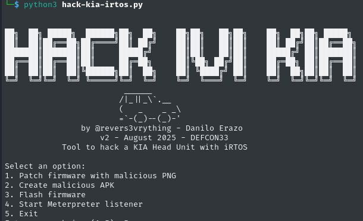

# hack-kia-irtos



🔓 **hack-kia-irtos** is a powerful post-exploitation framework that targets a newly discovered operating system named **iRTOS**, reverse engineered from Kia IVI firmware dumps. This tool leverages a **vulnerability in the iRTOS boot process** to implant a **malicious PNG image**, resulting in what is arguably the most **sophisticated and dangerous QR phishing attack in all over the world**.

👾 This zero-day technique will be publicly demonstrated at **DEFCON 33**.

---

## Disclosure

This tool is released **for educational and research purposes only**. The iRTOS vulnerability was responsibly disclosed to the affected vendors prior to the release of this tool. Use of this software against systems you do not own or have explicit permission to test is **illegal and unethical**.

---

## Features

This CLI tool provides the following options:

```
1. Patch firmware with malicious PNG
2. Create malicious APK
3. Flash firmware
4. Start Meterpreter listener
5. Exit
```

---

## How it Works

The vulnerability lies in the **image integrity verification bypass** during the boot process of iRTOS-powered head units. By modifying the firmware's PNG boot assets, an attacker can embed a **malicious QR code** that appears immediately on boot — effectively bypassing OS-level mitigations.

Additionally, the framework includes utilities for:

- Generating Android Meterpreter payloads
- Repackaging APKs with embedded backdoors
- Flashing modified firmware via SPI
- Launching listeners with Metasploit for full remote session capture

---

## ⚙️ Requirements

- A Linux-based system (tested on Kali Linux)
- Python 3
- Installed tools:
  - `metasploit-framework`
  - `binwalk`
  - `dd`
  - `flashrom`
  - `apktool`
  - `apksigner`

---

## 🛠️ Installation

```bash
git clone https://github.com/yourname/hack-kia-irtos.git
cd hack-kia-irtos
chmod +x install.sh
./install.sh
```

---

## 🚀 Usage

```bash
python3 hack-kia-irtos.py
```

---

## Author

**Danilo Erazo**  
Independent Security Researcher  
DEFCON Speaker | Car Hacking Village Contributor  
Twitter: [@revers3vrything](https://x.com/revers3vrything)  
YouTube: [Hardware Hacking & RE](https://www.youtube.com/@revers3everything)

---

## 🧷 Legal Disclaimer

This tool is provided for educational and authorized research purposes only.  
The author is **not responsible** for any misuse or damage caused by this tool.
